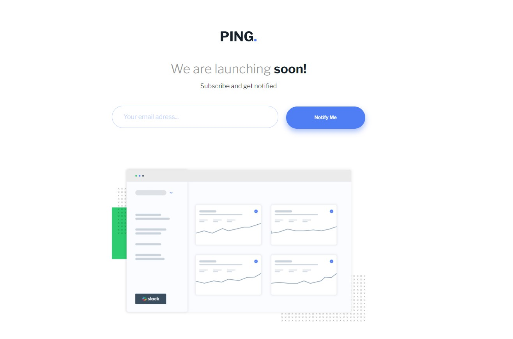

Live Site URL: [View live site](https://kilelx.github.io/Ping-Coming-Soon/)

# Frontend Mentor - Ping coming soon page solution

This is a solution to the [Ping coming soon page challenge on Frontend Mentor](https://www.frontendmentor.io/challenges/ping-single-column-coming-soon-page-5cadd051fec04111f7b848da). Frontend Mentor challenges help you improve your coding skills by building realistic projects. 

## Table of contents

- [Overview](#overview)
  - [The challenge](#the-challenge)
  - [Screenshot](#screenshot)
  - [Links](#links)
- [My process](#my-process)
  - [Built with](#built-with)
  - [What I learned](#what-i-learned)
  - [Useful resources](#useful-resources)
- [Author](#author)

## Overview

### The challenge

Users should be able to:

- View the optimal layout for the site depending on their device's screen size
- See hover states for all interactive elements on the page
- Submit their email address using an `input` field
- Receive an error message when the `form` is submitted if:
	- The `input` field is empty. The message for this error should say *"Whoops! It looks like you forgot to add your email"*
	- The email address is not formatted correctly (i.e. a correct email address should have this structure: `name@host.tld`). The message for this error should say *"Please provide a valid email address"*

### Screenshot

### Links

- Live Site URL: [View live site](https://kilelx.github.io/Ping-Coming-Soon/)

## My process

### Built with

- HTML5
- CSS3
- JavaScript 

### What I learned

This challenge made me discover the Regex : I faced some difficulties to find how to check the email adress, I needed to watch a tutorial.

### Useful resources

- [How to verify an email adress](https://docs.microsoft.com/fr-fr/dotnet/standard/base-types/how-to-verify-that-strings-are-in-valid-email-format#:~:text=Pour%20v%C3%A9rifier%20que%20l'adresse,de%20l'adresse%20de%20messagerie.) - This helped me a lot for the Regex

## Author

- Website - [Kieran LELEUX](http://www.kieran-leleux.com)
- Frontend Mentor - [@kilelx](https://www.frontendmentor.io/profile/kilelx)
